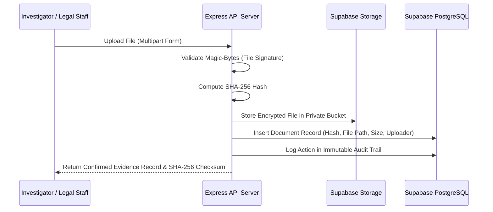

# Crown & Ledger Evidence Workspace

> **Secure Digital Document Management System for Legal & Investigation Documents**

---

## Author

**Avanish Singh**  
Creator and Lead Maintainer

## Project Ownership

This repository contains the original project implementation developed and maintained by **Avanish Singh**. 

All original system architecture, database schemas, frontend interfaces, backend services, security protocols, and judicial/investigative workflows are the original creation of the author. Third-party libraries, frameworks, icons, and tools utilized within this repository remain the intellectual property of their respective authors and copyright holders under their respective open-source licenses.

---

## Project Overview

**Crown & Ledger Evidence Workspace** is an enterprise-grade, high-security digital document and evidence management platform architected for modern legal practices, law enforcement agencies, forensic laboratories, and judicial benches.

In contemporary jurisprudence and criminal investigations, maintaining unimpeachable evidence integrity, strict regulatory compliance, and a verifiable chain of custody is paramount. Crown & Ledger solves these critical challenges by combining:
- Hardware-aligned cryptographic verification (automated SHA-256 digest computation).
- Multi-party custody transfer receipts with digital acknowledgment.
- Comprehensive forensic analysis workbench with device isolation and tool tracking.
- Specialized judicial docketing and courtroom bench workflows.
- Immutable, chronological audit trails with automated security anomaly detection.
- Generative AI assistance for document summarization and legal brief extraction.

---

## Key Features

- **Multi-Persona Role-Based Access Control (RBAC):**  
  Fine-grained privilege tiers across 8 distinct institutional personas ensuring strict principle-of-least-privilege enforcement.

- **Cryptographic Chain of Custody:**  
  Every piece of physical or digital evidence logged in the workspace receives an automated SHA-256 hash at ingress. Transfers between investigating officers, forensic labs, evidence lockers, and courtrooms generate cryptographically tracked custody transfers.

- **Forensic Workbench & Lab Reports:**  
  Specialized interface for forensic analysts to document extraction tools (e.g., Cellebrite, EnCase, FTK), track device condition, record write-blocker serials, log forensic findings, and attach formal lab reports to case dockets.

- **Judicial Bench & Hearing Management:**  
  Dedicated courtroom interface for judges and judicial clerks to review evidence admitted for hearing, annotate confidential case files, manage case stages (Filing, Hearing, Deliberation, Closed), and schedule hearing calendars.

- **Investigating Officer & Police Station Workflows:**  
  Streamlined evidence intake for police officers, FIR/case linking, chain-of-custody transfer dispatch, forensic requisitioning, and charge-sheet compilation.

- **Zero-Trust Document Security & Magic-Byte Validation:**  
  All uploaded files undergo magic-byte signature validation at the API boundary to prevent MIME-spoofing and executable payloads. Files are stored in encrypted private buckets accessible only through short-lived signed URLs.

- **Tamper-Evident Audit Logging:**  
  Every view, search, export, metadata update, and access request is recorded with IP metadata, user identity, and millisecond timestamps in an append-only audit register.

- **AI-Powered Evidence Intelligence:**  
  Integrated Google Gemini AI pipeline to automatically summarize lengthy contracts, forensic dumps, affidavits, and police reports into concise legal briefs.

---

## Security Architecture

Crown & Ledger is engineered around a defense-in-depth security model:

```
[ Client Interface (React / Vite / TS) ]
                │
                │ Bearer JWT Authentication (HTTPS)
                ▼
[ API Gateway / Express Server ]
   ├── Magic-Byte Signature Validation (File Upload Ingress)
   ├── Input Sanitization & Zod Schema Validation
   ├── Service-Role Isolation (Credentials shielded from browser)
   └── Cryptographic Hashing Engine (Node crypto SHA-256)
                │
                ├── Row-Level Security (RLS) & Granular RBAC
                ▼
[ Supabase PostgreSQL & Storage Engine ]
   ├── Private Evidence Buckets (Non-public, Time-Limited Signed URLs)
   ├── Encrypted Database Tables (AES-256 at rest)
   └── Append-Only Audit Log Tables
```

1. **Magic-Byte Signature Verification:** Before any file is written to storage, the server inspects the first chunk of bytes to verify that the file header matches its claimed MIME type (PDF `%PDF-`, PNG `\x89PNG`, JPEG `\xFF\xD8\xFF`, etc.).
2. **Deterministic SHA-256 Hashing:** Files are hashed in-memory via Node.js `crypto` upon receipt; subsequent access verifies hash parity to alert against tampering or bitrot.
3. **Backend Service-Role Isolation:** The Supabase `service_role` key is strictly kept in server environment memory and is never bundled into client assets or exposed over network responses.
4. **Time-Limited Signed URLs:** Document downloads and previews are served via cryptographically signed URLs that expire after 15 minutes.

---

## Technology Stack

### Frontend
- **React** (v19) — Component-driven reactive user interface
- **Vite** — High-performance frontend build tooling
- **TypeScript** — End-to-end static type safety
- **Tailwind CSS** — Modern, design-system utility styling
- **Motion** — Fluid animations and micro-interactions
- **Lucide React** — Consistent judicial and technical iconography

### Backend
- **Node.js** — Scalable JavaScript runtime
- **Express** — Robust RESTful API server
- **TypeScript** — Server-side type contracts and validation

### Database / Infrastructure
- **Supabase** — Managed PostgreSQL database platform
- **PostgreSQL** — Relational database with relational integrity
- **Supabase Auth** — Identity verification and session management
- **Supabase Storage** — Secure, private object storage for evidence artifacts

### Security
- **JWT authentication** — Stateless, secure session tokens
- **RBAC (Role-Based Access Control)** — Enforced at both API route and database layers
- **PostgreSQL RLS (Row Level Security)** — Enforcing database tenant and user data boundaries
- **SHA-256 integrity verification** — Algorithmic tamper detection
- **Immutable audit logging** — Append-only chronological operational log
- **Chain of custody** — Relational audit trail for evidence handoffs
- **Signed URLs** — Short-lived, authorized media access tokens
- **Magic-byte validation** — Binary header validation against file spoofing

---

## System Roles & Institutional Personas

| Role Identifier | Institutional Persona | Primary Responsibilities |
|---|---|---|
| `judge` | Judicial Officer / Magistrate | Presiding over matters, issuing court orders, reviewing submitted evidence, setting hearing dates. |
| `investigating_officer` | Police Inspector / Lead Investigator | Logging case evidence, recording FIRs, initiating forensic requisitions, transferring custody. |
| `forensic_specialist` | Forensic Lab Examiner | Device acquisition, write-blocking verification, lab tool report creation, evidence hash validation. |
| `managing_partner` | Senior Legal Partner | Firm-wide matter oversight, high-level case assignment, privileged document management. |
| `senior_associate` | Senior Legal Counsel | Case briefing, evidentiary motion drafting, access authorization management. |
| `junior_associate` | Legal Associate | Research, document tagging, initial client intake drafting. |
| `compliance_officer` | Security & Compliance Auditor | Audit trail inspection, anomaly detection, security log reviews. |
| `external_auditor` | External Independent Auditor | Read-only compliance validation, chain of custody verification. |

---

## Major Workflows

### 1. Evidence Ingestion & Cryptographic Hashing


### 2. Chain of Custody Transfer
- **Release:** The current custodian logs a transfer request specifying receiving officer, transfer type (e.g., `court_submission`, `forensic_analysis`, `safe_storage`), and transfer purpose.
- **Verification:** The receiving party verifies physical seal, condition, and cryptographic checksum.
- **Receipt:** Both parties confirm receipt, recording timestamp and custody location.

### 3. Forensic Examination
- Specialist registers physical device make, model, serial number, and condition.
- Verifies write-blocker connection and calculates baseline pre-extraction hash.
- Logs extraction findings and tool outputs (Cellebrite, EnCase, FTK).
- Generates official forensic report linked directly to the parent matter and case docket.

### 4. Courtroom Docket & Judicial Adjudication
- Judge accesses the **Bench View** to review filed matters and scheduled hearings.
- Analyzes admitted evidence and verified chain of custody.
- Enters judicial bench notes and updates case stages.

---

## Getting Started

### Prerequisites
- **Node.js** (v18.0.0 or higher recommended)
- **npm** (v9.0.0 or higher)
- A **Supabase** account with a configured project

### Installation

1. **Clone the repository:**
   ```bash
   git clone https://github.com/your-username/crown-ledger-evidence-workspace.git
   cd crown-ledger-evidence-workspace
   ```

2. **Install project dependencies:**
   ```bash
   npm install
   ```

3. **Configure Environment Variables:**
   Copy `.env.example` to `.env`:
   ```bash
   cp .env.example .env
   ```
   Fill in your configuration details:
   ```env
   # Frontend / Supabase Client Configuration
   VITE_SUPABASE_URL=https://your-project.supabase.co
   VITE_SUPABASE_ANON_KEY=your-supabase-anon-key

   # Backend Server Configuration
   PORT=3000
   SUPABASE_URL=https://your-project.supabase.co
   SUPABASE_SERVICE_ROLE_KEY=your-supabase-service-role-key

   # AI Integration (Optional)
   GEMINI_API_KEY=your-gemini-api-key
   ```
   > **Note:** Never commit the `.env` file to version control. The `.gitignore` file is preconfigured to prevent secret leaks.

4. **Initialize Database Schema:**
   Apply the SQL migration scripts located in `supabase/migrations/` via your Supabase SQL Editor.

### Development Commands

Start the full full-stack application (Express API server + Vite client concurrently):
```bash
npm run dev
```
The application will be accessible at:
- Web Application: `http://localhost:3000`
- API Health Endpoint: `http://localhost:3000/api/health`

### Build & Verification Commands

- **Code Style & Linting:**
  ```bash
  npm run lint
  ```
- **Production Build:**
  ```bash
  npm run build
  ```

---

## Security Notes

- **Credential Hygiene:** No credentials, service-role keys, or database passwords should ever be hardcoded into frontend scripts or committed to Git.
- **Vulnerability Reporting:** If you discover a security vulnerability in this workspace, please consult [.github/SECURITY.md](.github/SECURITY.md) for our responsible disclosure procedure.

---

## License

Copyright © 2026 Avanish Singh. All rights reserved.

This repository is publicly viewable for educational, demonstration, evaluation, and reference purposes. No license is granted to copy, modify, distribute, sublicense, sell, or create derivative works from the original project materials without explicit permission from Avanish Singh.

Third-party libraries and dependencies remain subject to their respective licenses. See THIRD_PARTY_NOTICES.md.

## Third-Party Attributions

This project relies on open-source libraries, frameworks, and developer tools. We gratefully acknowledge the creators and maintainers of these projects. For a complete list of third-party dependencies, copyright holders, and license types, please see [THIRD_PARTY_NOTICES.md](THIRD_PARTY_NOTICES.md).

---

Copyright © 2026 Avanish Singh. All rights reserved.
